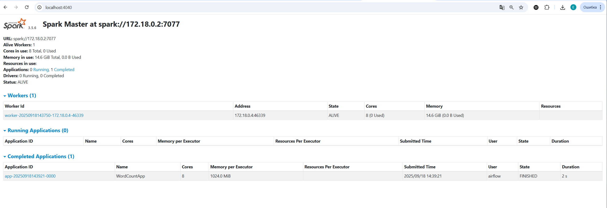
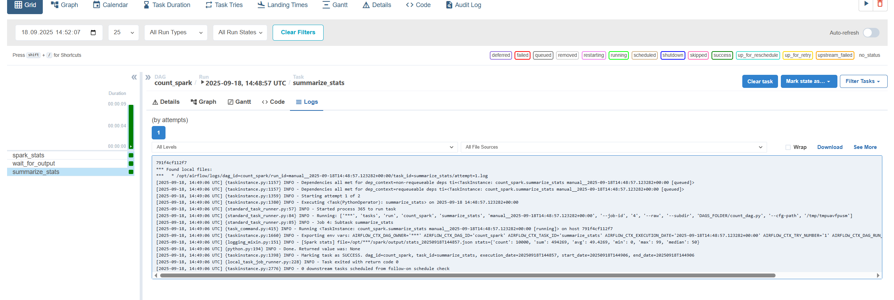
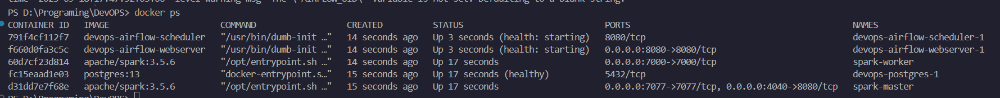

# Spark Stats Pipeline

Проект с простым DAG, который использует Docker Compose и Spark для вычислений.  
Airflow управляет запуском Spark-задачи, которая считает статистику и сохраняет результат в JSON.


## Содержимое

```
itmo-2sem-devops/
├── dags/
│ ├── count_dag.py
├── spark/
│ ├── spark_task.py
│ ├── spark_stats.py
├── logs/
├── Dockerfile
├── docker-compose.yml
└── README.md           
```


## Описание DAG и spark-job

1. **DAG `count_spark`**:
   - запускает Spark-задачу `spark_stats.py`;
   - ждёт появления результата (JSON-файл);
   - читает его и выводит статистику в лог, а также сохраняет в XCom.

2. **Spark-задача `spark_stats.py`**:
   - генерирует случайные числа (или может читать CSV с колонкой `value`);
   - считает агрегаты:
     - количество (`count`)
     - сумму (`sum`)
     - среднее (`avg`)
     - минимум (`min`)
     - максимум (`max`)
     - медиану (`median`)
   - сохраняет результат в JSON: `/opt/airflow/spark/output/stats_<timestamp>.json`.


## Как запустить

1. Клонируйте репозиторий:

2. Запустите контейнеры:
   ```bash
   docker-compose up -d
   docker ps
   ```

3. Откройте Airflow: `http://localhost:8080` (логин: `airflow`, пароль: `airflow`).

4. Добавьте соединение:
Conn Id: spark_local
Conn Type: Spark
Host: spark-master
Port: 7077

5. Запустите DAG `count_dag` и проверьте логи.


## Остановка

```bash
docker-compose down -v
```


## Скриншоты






