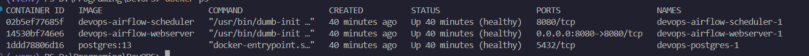
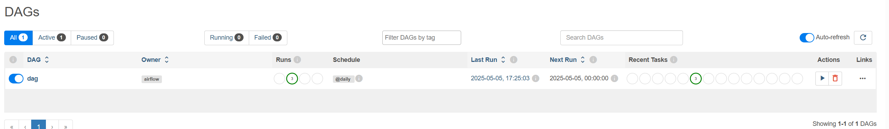
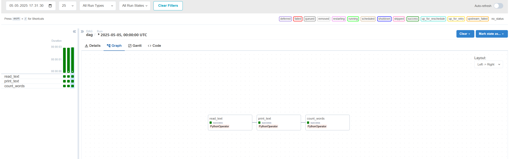

# Лабораторная работа 1: Airflow + Docker Compose
# Lab 1: Airflow + Docker Compose

---

## Установка
1.  Убедитесь, что установлены **Docker** и **Docker Compose**.  

2.  Клонируйте репозиторий:

    ```sh
    git clone https://github.com/Evgeninio/DevOpsAITH.git
    cd DevOpsAITH

    ```

## Запуск

1.  Запустите Airflow с помощью Docker Compose:

    ```sh
    docker-compose up -d
    ```

2.  Проверьте, запущены ли контейнеры:

    ```sh
    docker ps
    ```

3.  Перейдите в веб-интерфейс Airflow:

    [http://localhost:8080/](http://localhost:8080/)

    Логин: `airflow`  
    Пароль: `airflow`

## Скриншоты

1.  Запущенные контейнеры
    

2.  Список DAG-ов
    

3.  Информация о DAG
    


### Структура проекта

```bash
airflow-lab/
│── dags/                   # Папка с DAG-ами
│   └── input/              # Папка с input-файлом
        └──input.txt
    └── output/             # Папка с output-файлом
        └──output.txt
    └── dag.py              # Пример DAG
│── imgages/                # Папка с изображениями для документации
│── Dockerfile              # Конфигурация Docker-образа
│── docker-compose.yml      # Конфигурация Docker Compose
│── README.md               # Этот файл
```